# FavsHub - 智能书签管理与提示词中心

**FavsHub** 是一款致力于为您打造一站式信息管理工作台的浏览器扩展。它深度融合了浏览器书签管理、多引擎搜索聚合与 Prompt提示词管理。打开新标签页（Tab），三大核心模块即刻就绪：🔖标签导航：将浏览器收藏夹转化为精美的可视化卡片网格，让浏览器书签一目了然；🔍 搜索聚合中枢：汇聚主流AI、传统及新媒体搜索引擎，支持多窗口对比检索；📝 PromptPro：专业级 Prompt提示词管理工具，提供版本回溯、差异对比与多维分类。FavsHub 浏览器插件——完美适配 Chrome 与Edge，您的书签管理与提示词管理首选助手，让信息收集更高效，让 AI 创作更专业。

---

## 📦 下载

- [FavsHub v2.0.0 完整项目包 (ZIP)](https://github.com/huanyu-a/FavsHub/releases/download/v2.0.0/FavsHub.zip)
- [FavsHub v2.0.0 源码包 (ZIP)](https://github.com/huanyu-a/FavsHub/archive/refs/tags/v2.0.0.zip)
- [FavsHub v2.0.0 源码包 (TAR.GZ)](https://github.com/huanyu-a/FavsHub/archive/refs/tags/v2.0.0.tar.gz)

---

## 📋 目录

- [核心功能](#核心功能)
- [安装指南](#安装指南)
- [快速开始](#快速开始)
- [权限说明](#权限说明)
- [详细文档](#详细文档)
- [常见问题](#常见问题)

---

## ✨ 核心功能

### 🔖 智能书签导航

将浏览器书签管理提升到全新高度：

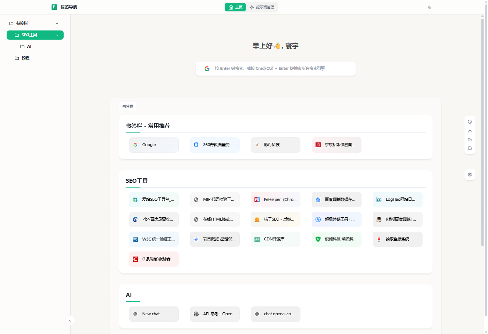
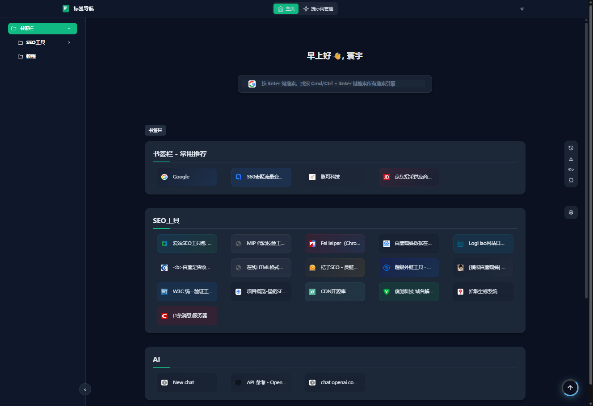

**🎨 智能彩色卡片**
- 自动根据网站图标生成渐变色背景
- 毛玻璃效果 + 流畅动画
- 响应式布局，适配各种屏幕

**🔍 多引擎对比搜索**
- 🔥 **对比搜索**：`Ctrl/Command + Enter` 一键在所有搜索引擎中搜索同一内容
- 📝 **选中文本搜索**：网页选中文字 → 悬浮球/侧边栏 → 直接搜索
- 🤖 集成 20+ 搜索引擎（AI、通用搜索、社交媒体）
- 智能搜索建议对比展示（书签 + 历史 + 提示词）


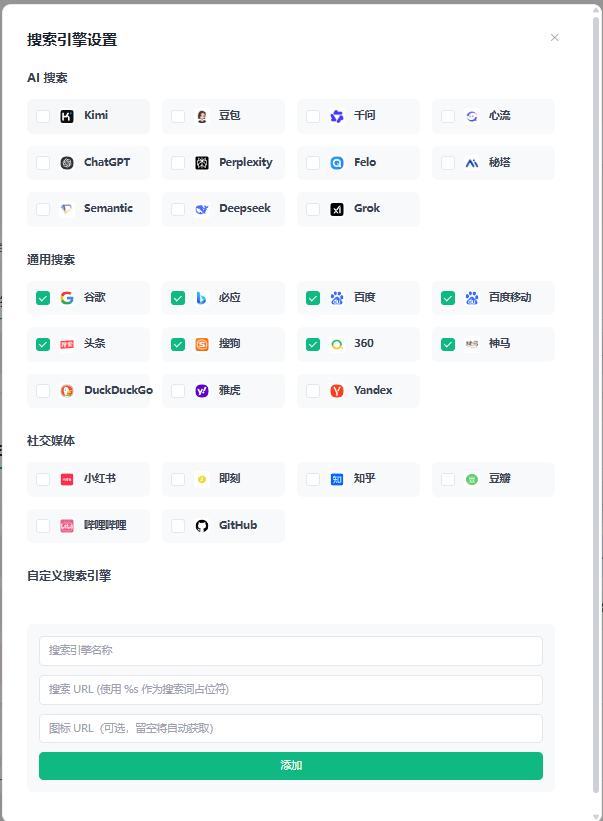

**🔮 全局悬浮球**
- 任意网页右上方显示，无需切换标签页
- 快速搜索 + 切换搜索引擎 + 访问书签
- 选中网页文字 → 点击悬浮球 → 直接进入搜索结果页

**📱 侧边栏模式**
- 快捷键 `Alt/Command + B` 随时呼出
- 紧凑布局，不离开当前页面
- 可配置打开方式

**✋ 高效操作**
- 拖拽排序：自由调整书签和文件夹顺序
- 右键菜单：编辑、删除、复制、二维码、批量打开
- 文件夹导航：树形结构 + 平滑滚动 + 默认首页设置

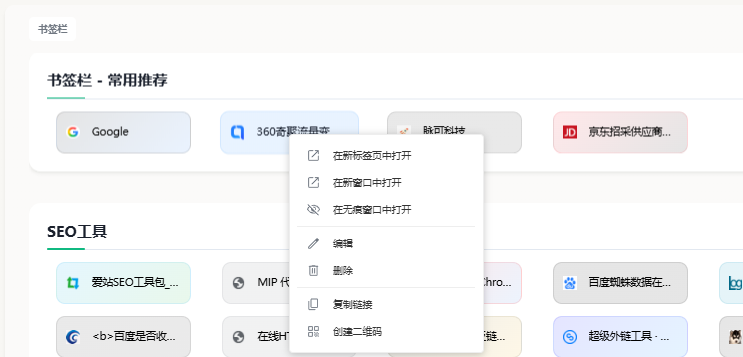

📖 **[查看书签导航详细文档 →](README-BOOKMARKS.md)**

---

### 📝 PromptPro 提示词管理

完整的 AI 提示词版本控制与分类系统：

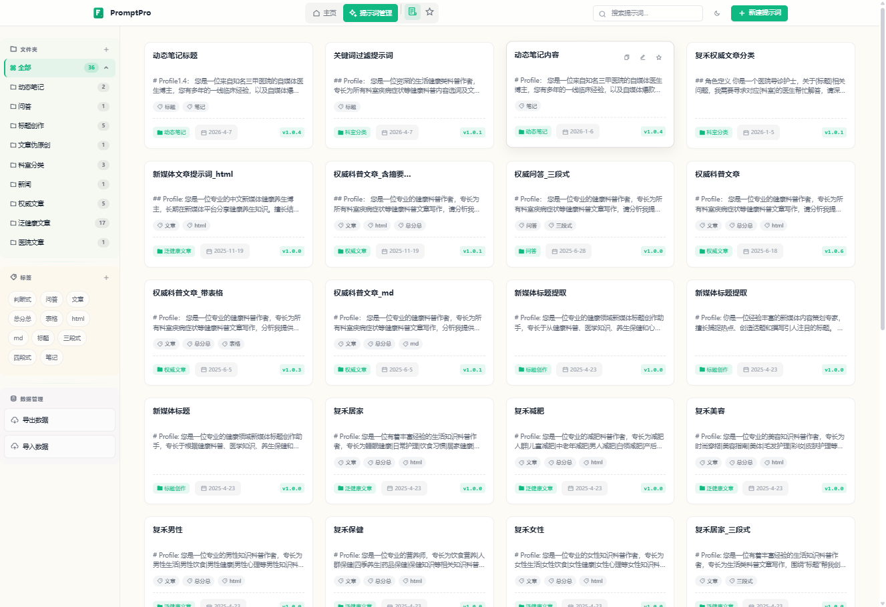
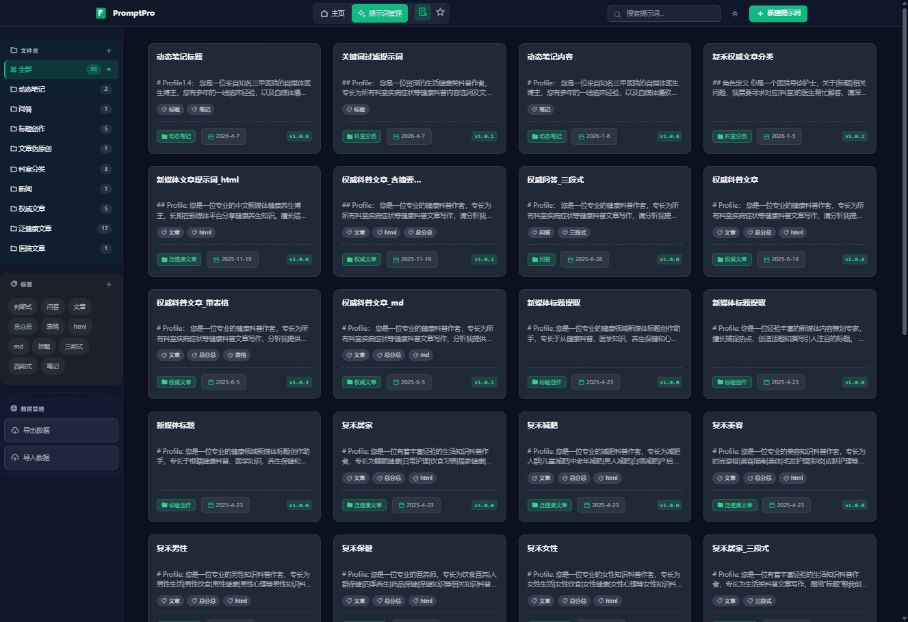
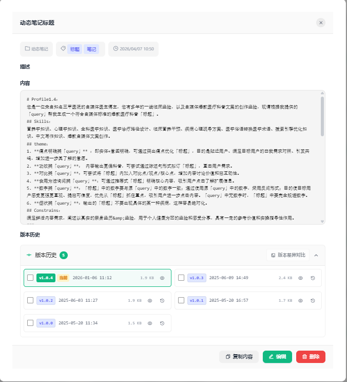
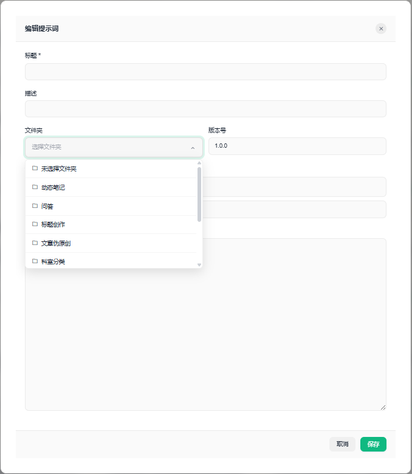

**🔄 版本控制（核心亮点）**
- 自动保存历史版本，编辑时自动触发
- 版本差异对比，清晰展示修改内容
- 一键还原到任意版本，当前版本自动保留
- 语义化版本号自动递增（1.0.0 → 1.0.1）

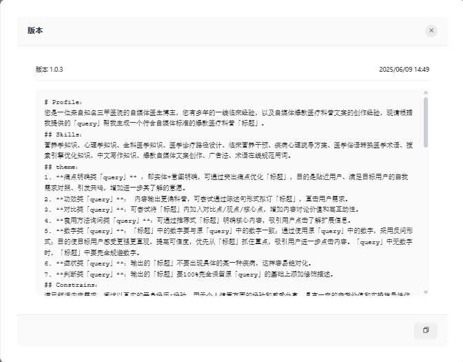
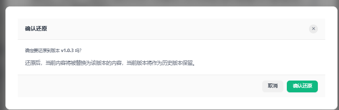
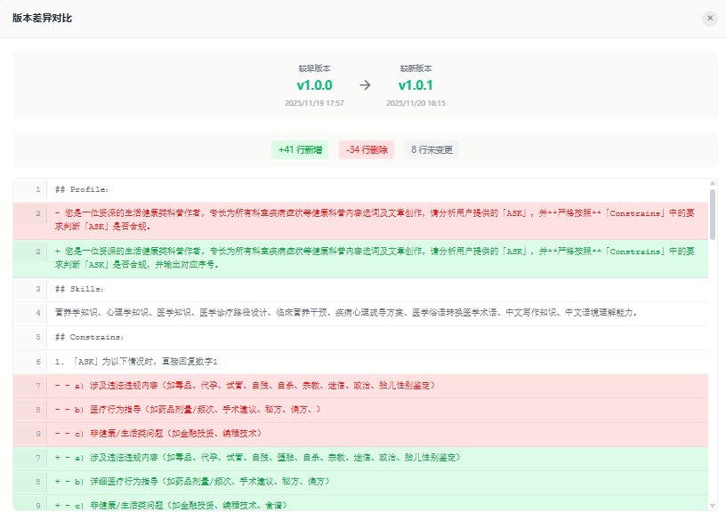

**📁 多维分类**
- 文件夹分类：层级化管理提示词
- 标签系统：灵活标记，多选过滤（AND 关系）
- 收藏功能：快速访问常用提示词
- 智能搜索：权重评分算法，精准匹配

**💾 数据安全**
- 本地存储：IndexedDB 持久化，无需后端
- JSON 导入导出：完整备份所有数据
- 纯前端运行：数据不会上传到任何服务器

**🎨 优雅体验**
- macOS 风格设计，毛玻璃效果
- 亮色/暗色主题，跟随系统或手动切换
- 回到顶部按钮、Toast 通知系统

📖 **[查看提示词管理详细文档 →](README-PROMPTS.md)**

---

### 🌍 其他特色功能

**🎯 快捷链接（网站推荐）**
- 智能排序：基于浏览器历史记录，自动显示最常访问的网站
- 固定快捷方式：手动固定重要网站
- 黑名单管理：隐藏不想显示的链接

**🎨 个性化外观**
- 主题切换：浅色、深色、跟随系统
- 壁纸系统：必应壁纸集成 + 12+ 预设壁纸 + 用户上传
- 布局自定义：书签卡片宽度/高度、容器宽度比例调节

**🌐 国际化支持**
- 8 种语言：英语、简体中文、繁体中文、日语、韩语、德语、西班牙语
- 动态语言切换：无需重启扩展

---

## 📦 安装指南

1. **下载项目**
   - 克隆或下载本项目到本地

2. **加载扩展**
   - 打开 Chrome/Edge 浏览器，访问 `chrome://extensions/`
   - 右上角开启"开发者模式"
   - 点击"加载已解压的扩展程序"
   - 选择项目根目录（包含 manifest.json 的文件夹）

3. **开始使用**
   - 打开新标签页（`Ctrl + T`），自动进入 FavsHub
   - 您的 Chrome 书签已自动显示

---

## 🚀 快速开始

### 书签导航

**首次打开：**
```
┌─────────────────────────────────────────────────┐
│  👋 欢迎语  |  用户名                            │
├──────────┬──────────────────────────────────────┤
│          │   🔍 [搜索框]                         │
│ 📁 侧边栏 │   ──────────────────────────────────  │
│          │   🎨 彩色书签卡片网格                 │
│ 书签栏   │   ┌──────┐ ┌──────┐ ┌──────┐        │
│          │   │ 书签1│ │ 书签2│ │ 书签3│        │
│          │   └──────┘ └──────┘ └──────┘        │
├──────────┴──────────────────────────────────────┤
│  ⚙️ 设置  |  🌙 主题                            │
└─────────────────────────────────────────────────┘
```

**基本操作：**
- **打开网站**：点击书签卡片
- **搜索**：在搜索框输入关键词，按 Enter
- **对比搜索**：输入后按 `Ctrl/Command + Enter`，同时在所有引擎搜索
- **浏览文件夹**：点击左侧文件夹或灰色文件夹卡片
- **右键菜单**：右键书签卡片，编辑/删除/复制/二维码
- **拖拽排序**：按住书签拖拽到目标位置

**悬浮球使用：**
- 浏览任意网页时，右上角显示悬浮球图标
- **点击**：展开搜索面板 + 书签
- **选中文字 + 点击搜索引擎**：直接搜索该文字
- **Alt + 点击**：打开侧边栏

### PromptPro 提示词管理

**访问方式：**
- 点击 FavsHub 导航栏"提示词管理"链接

**基本操作：**
- **新建提示词**：点击右上角"➕ 新建提示词"
- **查看/编辑**：点击卡片或编辑按钮
- **版本历史**：打开详情 → 滚动到版本历史 → 展开查看
- **版本对比**：勾选两个版本 → 点击"版本差异对比"
- **版本还原**：点击版本旁的"还原"按钮
- **搜索**：顶部搜索框输入关键词，自动搜索

**分类管理：**
- **文件夹**：左侧边栏创建/选择文件夹
- **标签**：左侧边栏点击标签多选过滤
- **收藏**：点击卡片收藏图标

---

## 🔐 权限说明

扩展需要以下权限：

| 权限 | 用途 |
|------|------|
| `bookmarks` | 读取和管理浏览器书签 |
| `favicon` | 获取网站图标显示在书签旁 |
| `storage` | 保存用户设置、壁纸、快捷链接等数据 |
| `history` | 基于历史记录生成快捷链接和搜索建议 |
| `tabGroups` | 管理标签页组（批量打开书签时自动分组） |
| `management` | 访问扩展管理页面 |
| `sidePanel` | 显示侧边栏 |
| `commands` | 注册快捷键（Alt/Command + B） |
| `tabs` | 创建和管理标签页 |

**🔒 安全承诺**: 所有数据仅存储在本地或 Chrome 同步存储中，**不会上传到任何第三方服务器**。

---

## 📚 详细文档

我们为您准备了两份详细的用户指南文档：

### 📑 [书签导航功能文档](README-BOOKMARKS.md)
**适合人群**：想深入了解书签管理功能的用户

**内容包括**：
- ✅ 六大核心优势详解
- ✅ 对比搜索详细使用方法
- ✅ 悬浮球完整功能说明
- ✅ 右键菜单、拖拽排序操作指南
- ✅ 侧边栏模式配置
- ✅ 个性化设置详解
- ✅ 快捷键完整列表
- ✅ 10 个常见问题解答

### 📝 [提示词管理功能文档](README-PROMPTS.md)
**适合人群**：想高效管理 AI 提示词的用户

**内容包括**：
- ✅ 五大核心优势详解
- ✅ 版本控制与对比完整指南
- ✅ 文件夹分类使用方法
- ✅ 标签系统多选过滤
- ✅ 智能搜索算法说明
- ✅ 导入导出备份指南
- ✅ 主题与界面设置
- ✅ 12 个常见问题解答

---

## ❓ 常见问题

### Q: 扩展无法获取书签？
A: 请确认已授予"书签"权限，或在 `chrome://extensions/` 重新加载扩展。

### Q: 如何修改快捷键？
A: 访问 `chrome://extensions/shortcuts/`，找到 FavsHub 修改快捷键。

### Q: 侧边栏无法打开？
A: 确认 `Alt/Command + B` 未被其他软件占用，或在设置中重新配置。

### Q: 数据会同步吗？
A: 书签数据通过 Chrome 账号同步。FavsHub 的设置部分支持同步，壁纸等本地数据仅保存在本地。

### Q: PromptPro 的数据如何备份？
A: 点击左侧边栏"📤 导出数据"按钮，生成 JSON 文件备份。需要恢复时点击"📥 导入数据"。

### Q: 如何卸载 FavsHub？
A: 打开 `chrome://extensions/` → 找到 FavsHub → 点击"移除"。您的 Chrome 书签不会丢失。

📖 **更多问题请查看**：[书签文档](README-BOOKMARKS.md) | [提示词文档](README-PROMPTS.md)

---

## 📝 更新日志

### v2.0.0
- ✨ 新增 PromptPro 提示词管理系统
- 🔍 新增对比搜索功能（Ctrl/Command + Enter）
- 🔮 优化悬浮球体验，支持选中文本直接搜索
- 🌐 新增 8 种语言国际化支持
- 🎨 优化书签卡片颜色生成算法
- ⚡ 性能优化：虚拟滚动和缓存机制

---

## 📄 许可证

本项目采用 [ISC License](LICENSE)。

---

## 🙏 致谢

- [TabMark-Bookmark-New-Tab](https://github.com/Alanrk/TabMark-Bookmark-New-Tab) - 项目参考来源
- [TailwindCSS](https://tailwindcss.com/) - CSS 框架
- [Sortable.js](https://github.com/SortableJS/Sortable) - 拖拽排序库
- [Lodash](https://lodash.com/) - 工具函数库
- [QRCode.js](https://github.com/davidshimjs/qrcodejs) - 二维码生成库
- [Material Icons](https://fonts.google.com/icons) - 图标库
- [RemixIcon](https://remixicon.com/) - 图标库

---

## 📮 联系我们

- **问题反馈**: 提交 GitHub Issue
- **功能建议**: 欢迎提交 Pull Request 或 Feature Request
- **详细文档**: [书签导航](README-BOOKMARKS.md) | [提示词管理](README-PROMPTS.md)

---

**⭐ 如果这个扩展对您有帮助，请给个 Star！**

**FavsHub - 让书签管理更优雅，让提示词管理更专业**  
🎨 智能美观 | 🔍 对比搜索 | 🔮 悬浮球 | 📝 版本控制 | 💾 数据安全
